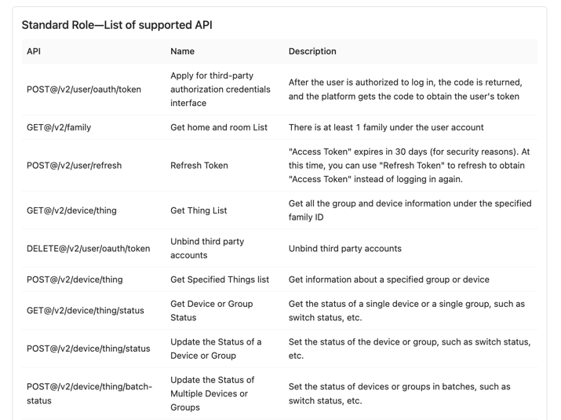

# [ewelink-api-next](https://github.com/nocmt/ewelink-api-next)


[](https://github.com/yanhaijing/jslib-base/blob/master/LICENSE)


English | [简体中文](README.zh-CN.md)

Coolkit V2 API library inspired by [ewelink-api](https://github.com/skydiver/ewelink-api)

## Characteristic

- Follow official document updates
- Concise and clear calling method

## Usage Instructions

Using npm, install `ewelink-api-next`(node >= 16.16)

```bash
npm i ewelink-api-next
# or pnpm add ewelink-api-next
```

### Example

#### ESM: Set {"type": "module"} in package.json

```typescript
// eWeLink v2 API

import eWeLink from "ewelink-api-next";

const client = new eWeLink.WebAPI({
  appId: "xxx",
  appSecret: "xxx",
  region: "us",
  logObj: eWeLink.createLogger("us") // or console
});

try {
  const response = await client.user.login({ account: "xxx@xxx.com", password: "12345678", areaCode: "+1" });
  const userInfo = response.error === 0 ? response.data.user : {};
  console.log("userInfo：", userInfo);
} catch (err) {
  console.log("Failed to get user information:", err.message);
}
```

```typescript
// eWeLink WebSocket API

import eWeLink from "ewelink-api-next";

const wsClient = new eWeLink.Ws({
  appId: "xxx",
  appSecret: "xxx",
  region: "us"
});

let ws = await wsClient.Connect.create({
  appId: wsClient?.appId || "",
  at: wsClient.at,
  region: "us",
  userApiKey: wsClient.userApiKey
});

setTimeout(() => {
  wsClient.Connect.updateState("xxxx", {
    switch: "on"
  });
}, 5000);
```

```typescript
// eWeLink Lan Control
import eWeLink from "ewelink-api-next";

const lanClient = new eWeLink.Lan({
  selfApikey: "xxx",
  logObj: eWeLink.createLogger("lan")
});

lanClient.discovery((server) => {
  console.log("server:", server);
}); // Start Discovery Service

// Save device information to local cache

// When controlling, it is necessary to pass in deviceId, secretKey, encryption, iv
try {
  const res = await lanClient.zeroconf.switch({
    ip: "xxx",
    port: 80,
    data: {
      switch: "on"
    },
    deviceId: "xxx",
    secretKey: "xxx",
    encrypt: true,
    iv: "xxx"
  });
  console.info("Request result:：", res);
  const res2 = await lanClient.zeroconf.switches({
    ip: "xxx",
    port: 80,
    data: {
      switches: [
        { switch: "on", outlet: 0 },
        { switch: "on", outlet: 1 },
        { switch: "on", outlet: 2 },
        { switch: "on", outlet: 3 }
      ]
    },
    deviceId: "xxx",
    secretKey: "xxx",
    encrypt: true,
    iv: "xxx"
  });
  console.info("Request result:：", res2);
} catch (error: any) {
  console.info(error.message);
}
```

#### CommonJS: Use `require` to import（ewelink-api-next@^1.0.2）

```javascript
const eWeLink = require('ewelink-api-next').default

const client = new eWeLink.WebAPI({
    appId: 'xxx',
    appSecret: 'xxx',
    region: 'cn',
    logObj: eWeLink.createLogger('eu'),
  })

;(async () => {
  let response = await client.user.login({
    account: 'xxx',
    password: 'xxx',
    areaCode: '+1',
  })
  console.info(JSON.stringify(response))
})()

```


The login method for the authorization page can be referred to：[https://github.com/nocmt/eWeLinkOAuthLoginDemo](https://github.com/nocmt/eWeLinkOAuthLoginDemo)

### Method Description

- [Basic specifications](./docs/en/Specification.md)
- [Built-in method](./docs/en/Built-inMethod.md)
- [User management](./docs/en/UserManagement.md)
- [Device management](./docs/en/DeviceManagement.md)
- [Home management](./docs/en/HomeManagement.md)
- [Message center](./docs/en/MessageCenter.md)
- [OAuth2.0](./docs/en/OAuth2.0.md)
- [WebSocket control](./docs/en/WebSocketControl.md)
- [LAN control](./docs/en/LAN-Control.md)
- [Other](./docs/en/Other.md)

## Supported Features

- [x] Homepage management
- [x] User management
- [x] Device management
- [x] Home management
- [x] Message center
- [x] OAuth2.0
- [x] WebSocket control
- [x] LAN control

## Change Log

[CHANGELOG](CHANGELOG.md)


## FAQ

Q: Why does the request return 407 error while requesting interface?

A: The list of available interfaces for the APPID you are currently using does not include this interface (limited by the application type). For example, applications created from the eWeLink developer center can only use the following interfaces:



Q: Unable to obtain device data through interfaces such as requesting homepage and get ThingList

A: The reason is that applications created from the eWeLink developer center only have free authorization for brands such as sonoff, SONOFF, 嵩诺, and coolkit. Authorization for other brands requires the manufacturer's consent (after payment, business communication).

Q: 4002 error returned while controlling the device

A: The device is offline or the control command is incorrect. Please refer to: [UIID Protocol - CoolKit Open Platform 4.2](https://coolkit-technologies.github.io/eWeLink-API/#/en/UIIDProtocol)

Q: How to obtain one's apikey?

A: If you do not have the interface permission to log in and obtain your account information, you can indirectly obtain it by calling interfaces such as GET@/v2/family, GET@/v2/device/thing and POST@/v2/device/thing, etc. Both home and device will be associated with your user account, and the field name is "apikey".

## Thanks

| Item                                                           | Reason                                            |
|----------------------------------------------------------------|---------------------------------------------------|
| [ewelink-api](https://github.com/skydiver/ewelink-api)         | Community projects, there are ideas to learn from |
| [wechat-api-next](https://github.com/lblblong/wechat-api-next) | Use of mixed mode and project structure reference |
